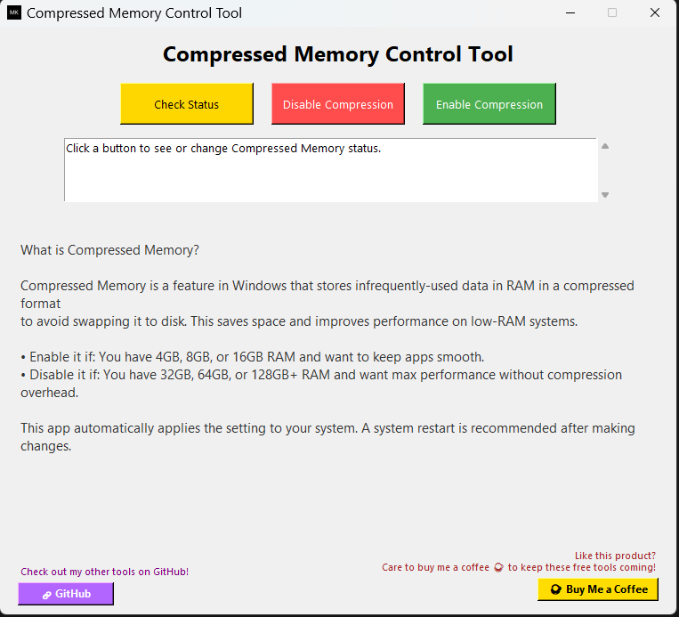
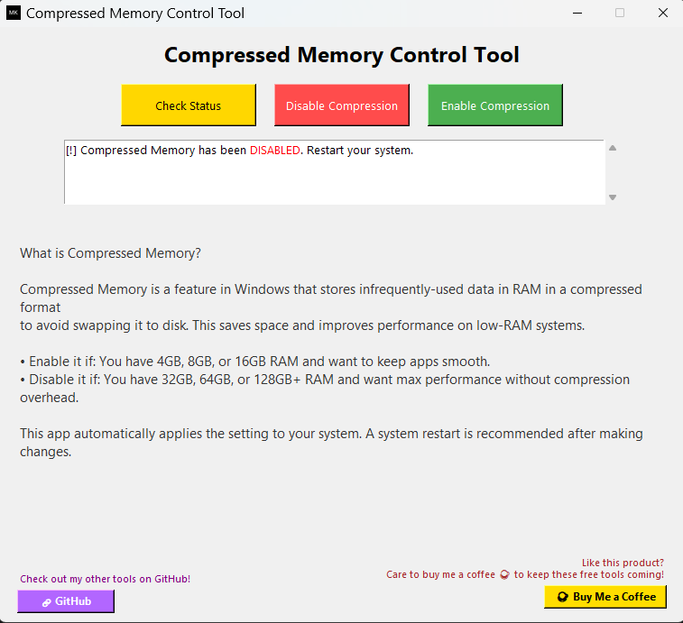
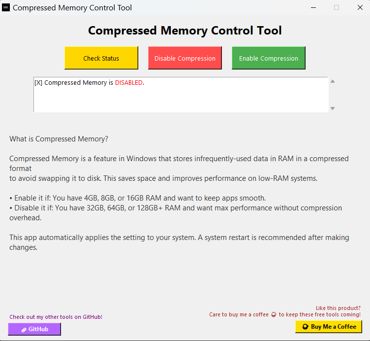
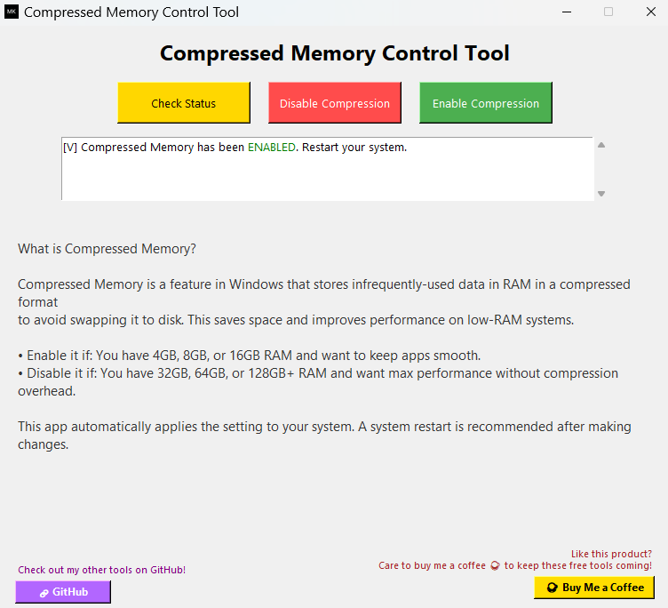

# 🧠 Compressed Memory Control Tool

 <!-- Replace with actual screenshot path -->

---

## 📌 Overview

**Compressed Memory Control Tool** is a beautifully designed Windows desktop application that allows users to **view**, **enable**, or **disable** Windows’ built-in **Compressed Memory** feature with a single click — no scripting knowledge needed.

> ✨ Built for non-technical users who want **performance control** without touching PowerShell or CMD.

---

## 📸 Screenshots

| Feature | Screenshot |
|--------|------------|
| ✅ Main Interface |  |
| 🔍 Check Status |  |
| ❌ Disable Compression |  |
| ✔️ Enable Compression |  |

---

## 🚀 Features

- 🔍 **Check if Compressed Memory is enabled**
- ❌ **Disable Compressed Memory** for high-RAM systems
- ✅ **Enable Compressed Memory** for low-RAM optimization
- 🛡️ **Admin auto-elevation** built-in
- 🧩 **One-click UI interface** – no PowerShell scripting required
- ☕ **Buy Me A Coffee** support button
- 💜 **GitHub Tools button** to explore more utilities
- 📦 Fully self-contained **`.exe`** — just run and use

---

## 🤔 What is Compressed Memory?

Windows uses a feature called **Compressed Memory** to reduce the size of less-used data in RAM instead of writing it to disk. This can improve responsiveness for low-memory systems.

### When should you enable it?

✔️ **Enable if**:
- You have **4GB to 16GB** of RAM
- You often run multiple programs
- You want smoother multitasking

❌ **Disable if**:
- You have **32GB, 64GB or more** RAM
- You want **maximum performance** without compression overhead
- You prefer manual RAM control for AI, gaming, video rendering, etc.

ℹ️ This app applies changes instantly. **A restart is recommended** for the changes to take full effect.

---

## 🛠️ How to Use

1. **Download the `.exe` file** (or clone the repo and build it yourself).
2. **Double-click to launch** – it will **ask for admin rights** (required by Windows).
3. Use the following buttons:
   - **Check Status** – Shows current memory compression state.
   - **Disable Compression** – Turns off Windows memory compression.
   - **Enable Compression** – Turns on memory compression.
4. Review the output in the log box.
5. (Optional) Click on:
   - ☕ **Buy Me A Coffee** if you found the tool useful.
   - 💜 **GitHub** to check out more scripts and tools by the developer.

---

## 📦 Building from Source

> Requires Python 3.10+, `pyinstaller`, and `tkinter`.

### 🔧 Installation

```bash
pip install pyinstaller
````

### 🧪 Compile to EXE

```bash
pyinstaller --noconfirm --onefile --windowed --icon "Personal_Picture.ico" --add-data "Personal_Picture.ico;." compressed_memory_gui.py
```

---

## 🧑‍💻 Developer

**Made with ❤️ by Mohammed Kashan Tariq**

This tool was created to help **non-technical users** control an advanced system setting — safely and easily.

> 🙌 Feel free to fork this project, give feedback, or contribute improvements!

---

## 📂 Repository Structure

```bash
📁 Compressed-Memory-Control-Tool/
├── compressed_memory_gui.py       # Main Python GUI application
├── Personal_Picture.ico           # Icon for window and taskbar
├── *.ps1                          # (Optional) PowerShell backup scripts
├── dist/                          # PyInstaller output
├── screenshots/                   # UI screenshots for README
├── README.md                      # This file
```

---

## 🥤 Support

If you like this tool and want to keep more free tools coming:

☕ [**Buy Me a Coffee**](https://coindrop.to/mr-shan)

---

## 📄 License

This tool is provided **free of charge** under the MIT License. Feel free to use, modify, and distribute — but please give credit where due.


